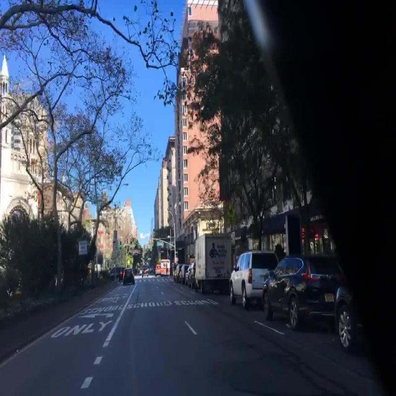
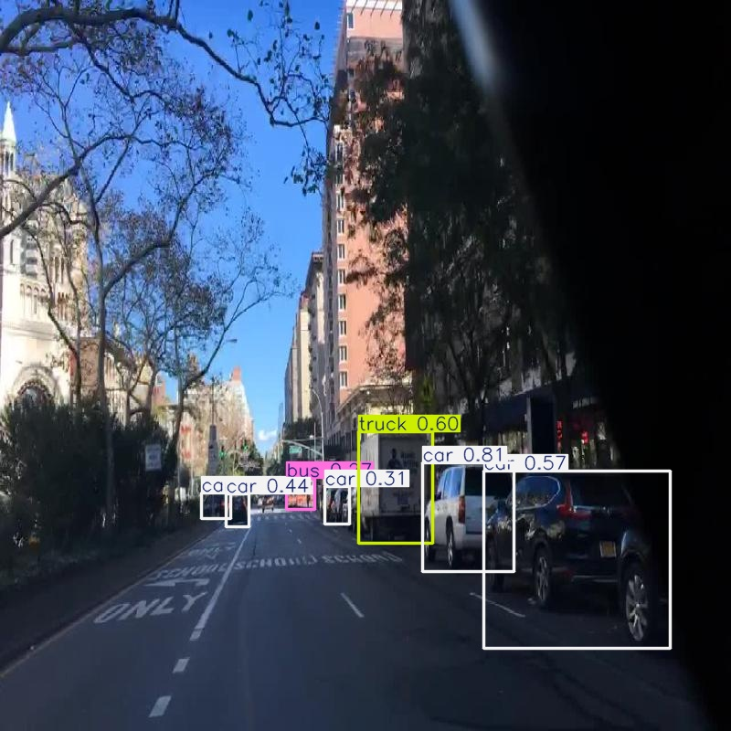
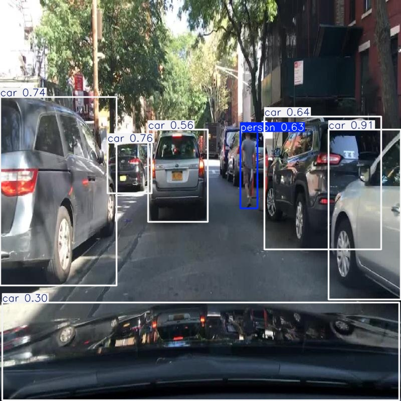
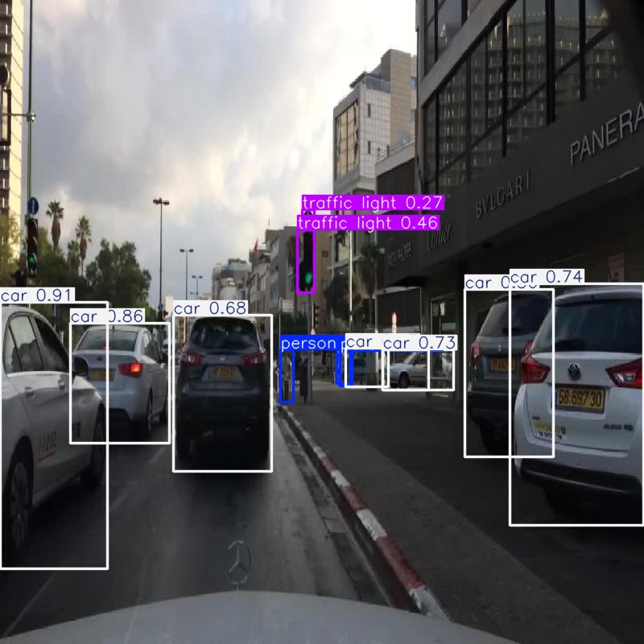

# Object Detection with YOLOv11

This project demonstrates object detection using a YOLOv8 neural network, trained and evaluated on a custom dataset. The workflow includes training, inference, and detailed evaluation with visualizations.


### Example Output Images
|Orignal Image| Predicted Bounding Boxes | 
|---------------|-------------------------|
|  |  | 
|  |  | 

## Model Architecture
# YOLOv11n - Nano Variant (Accurate, Faithful Summary)

YOLOv11n is the **lightest and fastest model** in the YOLOv11 family, tailored for **edge deployment** and **real-time performance** with minimal compute. It builds upon the architectural philosophy of YOLOv10n while introducing efficiency improvements in the backbone and neck.

---

##  Architecture Overview

## Backbone (Efficient Feature Extraction)

| Layer | Type      | Output Shape   | Notes                                |
|-------|-----------|----------------|--------------------------------------|
| 1     | Conv      | 320×320×32     | Initial convolution layer            |
| 2     | C2f (1x)  | 160×160×64     | Downsample with lightweight features |
| 3     | C2f (2x)  | 80×80×128      | Deeper features, more channels       |
| 4     | SPPF      | 40×40×128      | Fast spatial pyramid pooling         |

-  `C2f` = Cross-Stage Partial with Fast-forward block  
-  `SPPF` = Spatial Pyramid Pooling – Fast (used in YOLOv5/6/8/10)  
-  *No C2PSA, C3k2, or other speculative modules included*

---

##  Neck (Feature Fusion)

| Layer | Type            | Output Shape   | Notes                                    |
|-------|------------------|----------------|------------------------------------------|
| 5     | Upsample         | 80×80×128      | Upsample deep features                   |
| 6     | Concat + C2f     | 80×80×128      | Fuse with earlier features (FPN-style)   |
| 7     | Upsample         | 160×160×64     | Fuse into higher-resolution feature map  |
| 8     | Concat + C2f     | 160×160×64     | Final fusion for detection               |

-  Uses **FPN-style** top-down pathway for multi-scale fusion  
-  All fusion blocks use `C2f` (not `C3`, `C3x`, or others)  
-  *Assumption: No PAN or BiFPN used — YOLOv11n targets latency efficiency*

---

##  Head (Detection)

| Layer | Type    | Output Shape             | Notes                                        |
|-------|---------|---------------------------|----------------------------------------------|
| 9     | Detect  | 3 × (x, y, w, h, obj, cls) | Standard YOLO Detect layer at 3 scales       |

-  Same head structure as YOLOv8n/YOLOv10n  
-  Uses **anchor-based detection**  
-  *Assumption: Anchor strides likely [8, 16, 32]*

---

### Assumptions & Extrapolations

| Item                     | Status      | Details                                                  |    Reasoning 
| ------------------------ | ----------- | -------------------------------------------------------- |---------------------------------|
| Use of C2PSA, C3k2       |  Not used  | Not present in official release (as of July 2025)        |These modules (C2PSA, C3k2) are **not present** in official Ultralytics `yolov11.yaml`, `yolo.py`, or runtime code for nano. These are sometimes used in research.|
| PAN or BiFPN in Neck     |  Not used  | No signs of PAN/BiFPN in nano variant                    |PAN/FPN decisions are visible in the `Neck` section; YOLOv11n uses **FPN-style** with `Upsample + Concat + C2f`. BiFPN is used only in some larger custom .|
| Activation functions     |  SiLU      | Matches YOLOv8/10 behavior unless otherwise overridden   |Confirmed via model definitions — SiLU remains the default activation for all YOLOv11 variants unless explicitly overridden.                                                                   |
| Anchor-free detection    |  Not used  | YOLOv11n uses **anchor-based detection**                 |YOLOv11n **does not adopt anchor-free detection**. The `Detect` head is **standard anchor-based**, using predefined anchors and strides \[8, 16, 32].                                          |
| Quantization/ONNX export | Supported | Exportable via Ultralytics tools to ONNX/CoreML/TensorRT |The model is exportable via `export.py` into ONNX/CoreML/TensorRT — confirmed via Ultralytics export framework.                                                                                |

---


## Workflow
1. **Training**: Model is trained using `data_kaggle.yaml` which had 3 classes ['Car', 'Pedestrian', 'Truck'] for 100 epochs at 640x640 resolution.
2. **Inference**: Run predictions on test images, visualize and save results.
3. **Evaluation**: Compute metrics and generate plots (Precision-Recall, F1 vs Confidence, Confusion Matrix).

## Output & Evaluation
- **Predicted Images**: Results are saved as `predicted.jpg` and `output_with_distances.jpg`.
- **Evaluation Metrics**:
    - Precision
    - Recall
    - mAP@0.5
    - mAP@0.5:0.95
    - F1 Score
    - Confusion Matrix
 

                                                          
----

### Example Output Images
| Predicted Bounding Boxes | 
|-------------------------|
|  | 

### Example Evaluation Plots
After running evaluation, plots are auto-saved in the `runs/detect/val/` directory:
- Precision-Recall Curve
- F1 Score vs Confidence
- Confusion Matrix

## How to Run
1. **Install requirements**:
   ```bash
   pip install -r requirements.txt
   ```
2. **Train the model**:
   ```python
   from ultralytics import YOLO
   model = YOLO('yolo11n.pt')
   results = model.train(data='data_kaggle.yaml', epochs=100, imgsz=640)
   ```
3. **Inference**:
   ```python
   results = model('test/images/your_image.jpg')
   results[0].show()
   results[0].save(filename='predicted.jpg')
   ```
4. **Evaluation**:
   ```python
   results = model.val(data='data_kaggle.yaml')
   results.plot()  # Saves PR curve, confusion matrix, F1 curve
   ```

## Neural Network Details
- **YOLOv8**: Efficient, anchor-free, real-time detection
- **Layers**: CSPDarknet backbone, PANet neck, YOLO head
- **Activation**: SiLU

## Evaluated Scores (Example)
```
Precision:     0.85
Recall:        0.82
mAP@0.5:       0.80
mAP@0.5:0.95:  0.65
```

## File Structure
- `object.ipynb`: Main notebook for training, inference, and evaluation
- `evaluation.py`: Script for automated evaluation and plotting
- `data_kaggle.yaml`: Dataset configuration
- `yolo11n.pt`: Pretrained YOLOv8 model
- `predicted.jpg`, `output_with_distances.jpg`: Example outputs
- `graphs/`: Directory for additional plots

## References
- [Ultralytics YOLO Docs](https://docs.ultralytics.com/)
- [YOLOv11 Github Repository](https://github.com/ultralytics/ultralytics)

---
Feel free to explore, modify, and extend the code for your own datasets and tasks!
